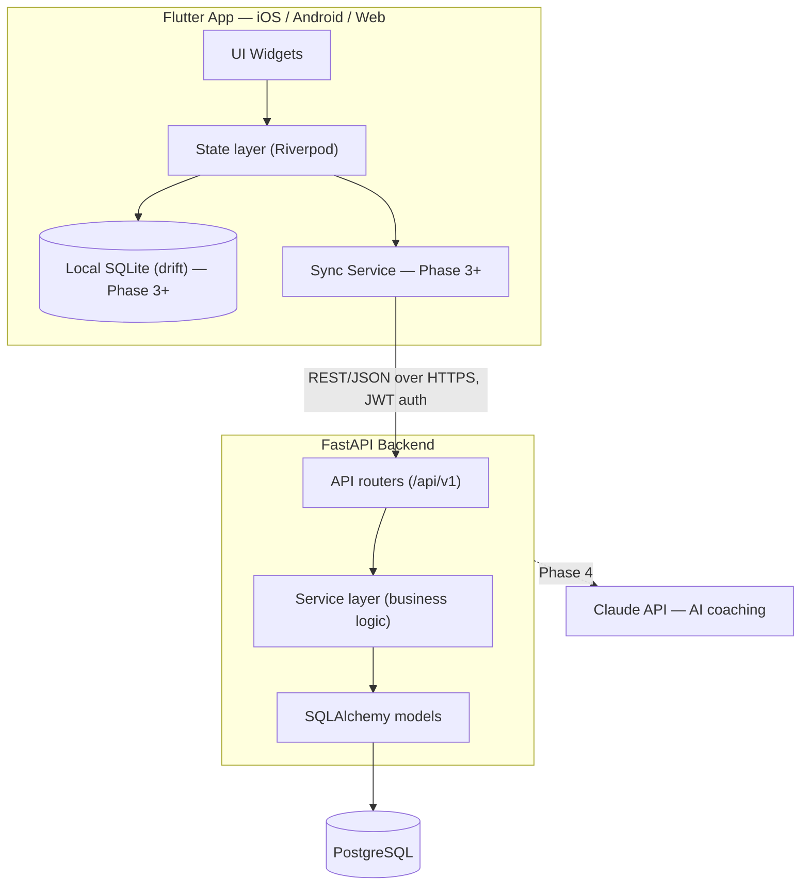

# Architecture

## Shape of the system

Client-server, REST over HTTPS, relational database. Nothing exotic — the interesting problem in
this app isn't distributed systems, it's making a fast, reliable logging experience on a phone
that might have terrible gym wifi/cell signal.

## Client-server split

- **Flutter app** owns all UI/UX for iOS, Android, and Web from a single codebase. It talks to
  the backend only through the REST API — no direct DB access, no business logic duplicated
  beyond basic input validation for responsiveness.
- **FastAPI backend** owns the source of truth (PostgreSQL), auth, and all business logic that
  matters for correctness (e.g. computing streaks, personal records, "last time" lookups). The
  client should be able to be dumb about business rules — it renders what the API gives it.

This split matters for a solo dev: it means you only have one place (the backend) where
"how is a streak calculated" or "what counts as a personal record" is defined, instead of trying
to keep client and server logic in sync.

## Offline-first: why it matters here, and when to build it

Gyms are notoriously bad wifi/signal environments (basements, steel racks, crowded routers). An
app where "log a set" fails because of a spinner is a bad app for this exact use case. So
offline support is a **real requirement**, not a nice-to-have — but it's also real complexity
(conflict resolution, sync queues, local schema migrations).

Decision: **ship online-only for the MVP**, then add offline-first in Phase 3 once the core
logging flow and data model are proven and stable. Retrofitting offline support onto a settled
schema is easier than designing for it before you know the shape of your data.

When it's built (Phase 3), the plan is:
- Local SQLite via `drift` is the client's source of truth for reads/writes during a session.
- Every mutation is queued locally and pushed to the backend when connectivity returns.
- Every record carries `updated_at` and a soft-delete flag (`deleted_at`) so sync can reconcile
  without hard deletes clobbering concurrent changes.
- IDs are client-generated UUIDs from day one (not server auto-increment integers) specifically
  so a record created offline never collides with one created elsewhere. This needs to be true
  from the MVP schema onward even though sync itself comes later — retrofitting UUID primary
  keys after the fact is painful. See [04-database-schema.md](04-database-schema.md).
- Conflict resolution strategy: last-write-wins per record using `updated_at`, which is good
  enough because workout data is almost always single-user, single-device-at-a-time.

## Backend layering

Inside FastAPI, a conventional layered structure:

- **Routers** (`api/v1/*`) — HTTP concerns only: parse request, call a service, return a response
  shaped by a Pydantic schema. No business logic here.
- **Services** — business logic: "start a session", "compute this week's streak", "find the last
  time this exercise was performed". This is the layer unit tests target most.
- **Models** — SQLAlchemy ORM models mapping to Postgres tables.
- **Schemas** — Pydantic models for request/response validation, kept separate from ORM models so
  the API contract doesn't leak database internals.

See [06-project-structure.md](06-project-structure.md) for the actual folder layout.

## Deployment topology

- **Backend**: containerized with Docker, deployed to a small managed host (Railway or Fly.io —
  both are solo-dev-friendly, cheap, and simple to deploy a single container to).
- **Database**: managed PostgreSQL (Neon or Supabase's Postgres, or the DB add-on from
  Railway/Fly). Managed means no time spent on backups/patching for a project this size.
- **Web app**: Flutter Web build deployed as static hosting (Firebase Hosting or Cloudflare
  Pages).
- **Mobile apps**: distributed via TestFlight (iOS) and Play Console internal testing (Android)
  during development, then to the App Store / Play Store for real release.
- **Environments**: dev (local Docker Compose: API + Postgres), and prod. A staging environment
  is not needed at this scale — add one only if it starts causing real pain.

## Scale posture

This is a single-user-owned-data app (each user only ever reads/writes their own rows) with
modest write volume (a handful of sets per session, a few sessions per week per user). There is
no scaling problem to solve here. Resist the urge to add caching layers, message queues, or
microservices before there's an actual bottleneck — the FastAPI + Postgres setup described here
comfortably handles thousands of users on a single small instance.

The one deliberate exception is **AI recommendations (Phase 4)**, called out as a separate
external dependency in the diagram above, because it involves a third-party API (Claude) with its
own latency/cost/rate-limit characteristics that the rest of the app shouldn't be coupled to.
