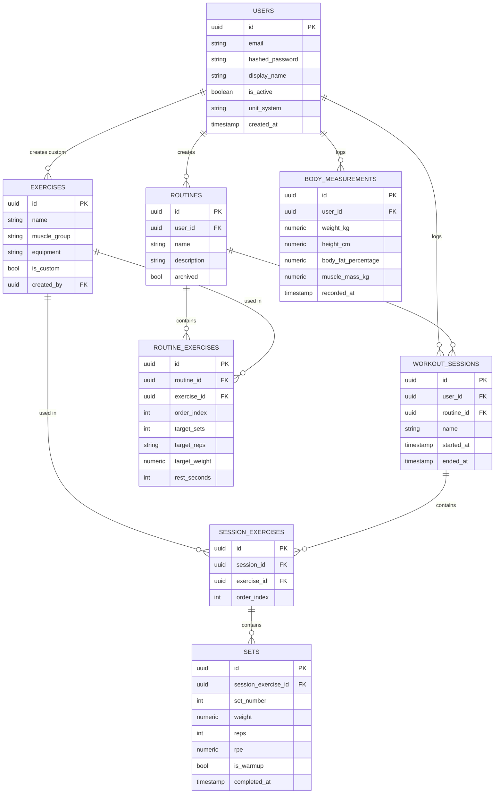

# Database Schema

Target: PostgreSQL. All primary keys are **UUIDs generated client-side or server-side at create
time** (not auto-increment integers) — this is required from day one even though offline sync
isn't built until Phase 3, because retrofitting UUID PKs onto an existing schema later is far
more painful than starting with them. See [02-architecture.md](02-architecture.md) for why.

Every table has `created_at`. Tables that users can edit/delete also have `updated_at` and
`deleted_at` (soft delete) — needed for sync/conflict-resolution later, and harmless now.

**Units are always stored canonically, never per-row.** Every weight value is stored in
kilograms (`numeric`), every height/length value in centimeters — regardless of what unit the
user entered or wants to see. `users.unit_system` (`metric` | `imperial`) records the user's
*display* preference only; conversion happens at the presentation layer (API response shaping or
the Flutter client — not yet decided which, revisit when we build the endpoints), never in the
database. This avoids mixed-unit data making aggregation/charts/PRs harder than they need to be.
Applies to `sets.weight`, `routine_exercises.target_weight`, and `body_measurements.weight_kg` /
`height_cm` alike.

## Entity relationship diagram

## Tables

### `users`

| Column | Type | Notes |
|---|---|---|
| id | uuid, PK | |
| email | text, unique, not null | |
| hashed_password | text, not null | bcrypt hash, never store plaintext |
| display_name | text, nullable | |
| is_active | boolean, default true | soft-disable a user without deleting their data |
| unit_system | enum, default `metric` | `metric` \| `imperial` — display preference only, see unit note above |
| created_at | timestamptz | |
| updated_at | timestamptz | |

### `exercises`

The exercise library. Seeded with ~50–100 common exercises at launch (bench press, squat,
deadlift, etc.), plus user-created custom exercises.

| Column | Type | Notes |
|---|---|---|
| id | uuid, PK | |
| name | text, not null | |
| muscle_group | enum | `chest`, `back`, `legs`, `shoulders`, `arms`, `core`, `full_body`, `cardio` |
| equipment | enum | `barbell`, `dumbbell`, `machine`, `bodyweight`, `cable`, `other` |
| is_custom | boolean, default false | true for user-created exercises |
| created_by | uuid, FK → users.id, nullable | null for seeded/global exercises |
| notes | text, nullable | optional instructions |
| created_at | timestamptz | |

### `routines`

A user's workout template, e.g. "Push Day".

| Column | Type | Notes |
|---|---|---|
| id | uuid, PK | |
| user_id | uuid, FK → users.id, not null | |
| name | text, not null | |
| description | text, nullable | |
| archived | boolean, default false | soft "hide" without losing history that references it |
| created_at | timestamptz | |
| updated_at | timestamptz | |

### `routine_exercises`

Join table: which exercises are in a routine, in what order, with what targets.

| Column | Type | Notes |
|---|---|---|
| id | uuid, PK | |
| routine_id | uuid, FK → routines.id, not null | |
| exercise_id | uuid, FK → exercises.id, not null | |
| order_index | int, not null | display order within the routine |
| target_sets | int, nullable | |
| target_reps | text, nullable | e.g. `"8-12"` — text, not int, to allow ranges |
| target_weight | numeric, nullable | kg, canonical — see unit note above |
| rest_seconds | int, nullable | |

### `workout_sessions`

An actual gym visit — a logged, real occurrence of training.

| Column | Type | Notes |
|---|---|---|
| id | uuid, PK | |
| user_id | uuid, FK → users.id, not null | |
| routine_id | uuid, FK → routines.id, nullable | null for ad-hoc (no-template) sessions |
| name | text, not null | **snapshot** of the routine name at session time, so renaming/deleting a routine later doesn't rewrite history |
| started_at | timestamptz, not null | |
| ended_at | timestamptz, nullable | null while a session is in progress |
| notes | text, nullable | |
| created_at | timestamptz | |

This table is also the source for the calendar heatmap and streaks — grouped by
`date(started_at)` per user. No separate "calendar" table is needed for the MVP; add a cached
aggregate later only if that query becomes a real bottleneck (unlikely at this scale).

### `session_exercises`

The exercises actually performed in a session. Deliberately **separate** from
`routine_exercises` — a session is a snapshot of what really happened, which may deviate from the
routine template (skipped an exercise, added one, different order).

| Column | Type | Notes |
|---|---|---|
| id | uuid, PK | |
| session_id | uuid, FK → workout_sessions.id, not null | |
| exercise_id | uuid, FK → exercises.id, not null | |
| order_index | int, not null | |

### `sets`

The atomic unit of logged work.

| Column | Type | Notes |
|---|---|---|
| id | uuid, PK | |
| session_exercise_id | uuid, FK → session_exercises.id, not null | |
| set_number | int, not null | |
| weight | numeric, nullable | kg, canonical — see unit note above; nullable for bodyweight exercises |
| reps | int, not null | |
| rpe | numeric, nullable | rate of perceived exertion, optional advanced field |
| is_warmup | boolean, default false | |
| completed_at | timestamptz, not null | |

### `body_measurements`

Body composition over time — deliberately separate from training data (`sets`/`workout_sessions`);
a user can log a weigh-in without it being tied to a gym session at all.

| Column | Type | Notes |
|---|---|---|
| id | uuid, PK | |
| user_id | uuid, FK → users.id, not null | |
| weight_kg | numeric, not null | kg, canonical — see unit note above |
| height_cm | numeric, nullable | cm, canonical; nullable — unlike weight this rarely changes entry-to-entry, so most logging UIs will only prompt for it occasionally, not every entry |
| body_fat_percentage | numeric, nullable | |
| muscle_mass_kg | numeric, nullable | |
| recorded_at | timestamptz, not null | when the measurement was taken (may differ from `created_at` if logged after the fact) |
| created_at | timestamptz | |

### Deriving "what did I lift last time"

No dedicated table needed — it's a query: most recent `sets` (via `session_exercises` →
`workout_sessions`) for a given `user_id` + `exercise_id`, ordered by `workout_sessions.started_at
desc`. This becomes a backend service function (see [05-api-design.md](05-api-design.md),
`GET /stats/exercises/{id}/last`) — deliberately computed on the backend, not duplicated in
client logic.

## Future tables (not built until their phase)

| Table | Phase | Purpose |
|---|---|---|
| `personal_records` | Phase 2 | cached PR badges (1RM estimate, max weight, max volume) per user+exercise, recomputed on set completion so PR lookups don't require scanning full history every time |
| `ai_recommendations` | Phase 4 | logged recommendation text + whether the user accepted it, per user/exercise/session |

## Indexing notes (apply when building, not upfront speculation)

- `sets(session_exercise_id)`, `session_exercises(session_id)`, `routine_exercises(routine_id)` —
  standard FK indexes.
- `workout_sessions(user_id, started_at)` — supports both history pagination and the calendar
  heatmap query.
- `exercises(created_by)` and a case-insensitive index on `exercises(name)` for search/autocomplete.
